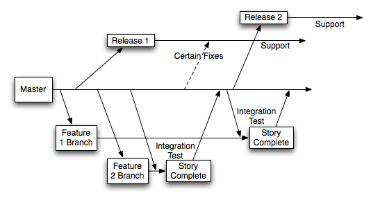

% Version Control:  Why, What and How
% Ted Stern
% February 23, 2012

# Why give this talk?

> - Version control is 'hard', so not used.
> - Copying seems good enough
> - Informal development postpones version control pain
> - You need to evangelize VCS to your group
> - People do not understand branching
> - How does Version Control Software (VCS) fit into Software Configuration Management?

# A version control story

A project was already maintained under Subversion, but was transferred to
another user.

The new user abandoned all existing history and started fresh with a new
Subversion repo.

What is wrong with this picture?

> - Cannot re-create previous versions.
> - Any lessons learned have been lost.
> - What was broken that needed fixing?

# Levels of abstraction

- Typewriter and paper
- Disk and Editor
- Backup files

    file.back1
    file.back2
    file.back3

- Backup directory snapshots / archives

    directory.date1
    directory.date2

- *Save only differences*
- Track directories and name-changes

See [The Git Parable](http://tom.preston-werner.com/2009/05/19/the-git-parable.html).

# Reasons

- Backup and Restore
- Collaboration
- Short/Long-term undo
- Tracking:
    + Changes
    + Ownership
- Branching / Merging / Third-party software

# Terms

- Repository
- Client / Server
- Working Copy (checkout)
- Trunk / Mainline

# Basic actions

- Revision
- Head
- Add
- Commit (checkin)
- Update (pull)
- Revert

# Advanced actions

- Branch
- Diff
- Merge
- Conflict
- Resolve

See
[Basic Guide to Version Control](http://betterexplained.com/articles/a-visual-guide-to-version-control/)

# Non-obvious stuff

- Track only the source, not the build products.
- Track directories, binaries, file renaming
- Group changes with atomic commits
- Why is branching and merging a Good Thing?

# End of 'Why?'

Now on to **What you want to do**.

Concepts now, details later

# Basic strategy

> - Checkout working copy
> - Edit some files
> - Save file(s)
> - Stage commit
> - Commit

# Branch/Merge, a "meta" version of checkout/change/save/commit

> - Mainline trunk for development.  The trunk should always "work".
> - Branch for any change bigger than "a day".
> - Branch for bug fixes.
> - Branch for features.
> - Branch for feature-freeze / release.
> - Tags should be cheap.  Tag specific versions or branch locations.

# When to branch?  Different philosophies

- [Branching is hard, treat it like a puppy](http://www.ericsink.com/scm/scm_branches.html)

    + CVS:  more like giving birth

    + Subversion:  Easier, but still tricky

- [May be hard, but better to branch more often](http://tech.puredanger.com/2008/06/03/release-and-branching-strategies/)

- Branch early and often
    + Git:  Whee!  Too easy?  Just clone and start working.

# Example:

# The right way to Merge:

- merge from parent to child often
    + to keep track of orthogonal changes and avoid conflicts.
- One final merge from parent to child,
    + before reintegrating merge from child back to parent again.

# Issue Tracking

It is a Good Thing to coordinate issue tracking with Version Control.

- Ticket can track multiple changes on a branch, for bug, feature, release.
- If you have good issue tracking and mod integration, you can tie together a set of mods into one composite mod.

# How you do it

There is no best Version Control software, and you can't really say that there is one until each of those tasks in Part 2 is easy, intuitive, and architecture independent.

That said, the best we've got right now are Subversion and Git.

# Strengths of Subversion, vs. Strengths of Git

Issue tracking that works with either Subversion  or Git.  Again, there is no
best software that does everything we want.

# Centralized repository:  Subversion

# Distributed development:  Git

- Examples of checkout/commit and branch/merge cycle in Subversion and Git.

# Issue tracking examples

- Trac
    + Works with Subversion, Git
    + Simpler than Bugzilla
    + In OSS Toolkit
- GitHub
    + Wave of future?
    [Wired article, 02/21/2012](http://www.wired.com/wiredenterprise/2012/02/github/all/1)
    + Built in issue tracking, makes branching/merging/collaboration easy
    + Enterprise license available

# Conclusions, part 1

> - Pick the VCS that is closest to the model for your project (centralized vs. distributed; consolidated source vs. lots of forking).

- Use an issue tracker that automatically integrates with your VCS.
    + *e.g.*, Trac
- Wrapping abstract actions in scripts

- If you have to wrap VCS in complex helper scripts, it is not the best tool for your project, though it may be the best currently available.  Always ask yourself: "Is this tool helping me more than it gets in the way?"  If it gets in the way more than 20% of the time, it is time to find a new tool.

# Conclusions, part 2 ...

Subversion, Git, et al. are actively developed, so don't freeze your VCS/SCM
model.  Be ready to change to a better method **when**, *not if* it becomes
available.  Ensure that you can convert your existing version history and
issue tracking to new systems.

# Conclusions, part 3 ...

- There is no best software
- Subversion vs. Git:
    + http://www.codeforest.net/git-vs-svn
